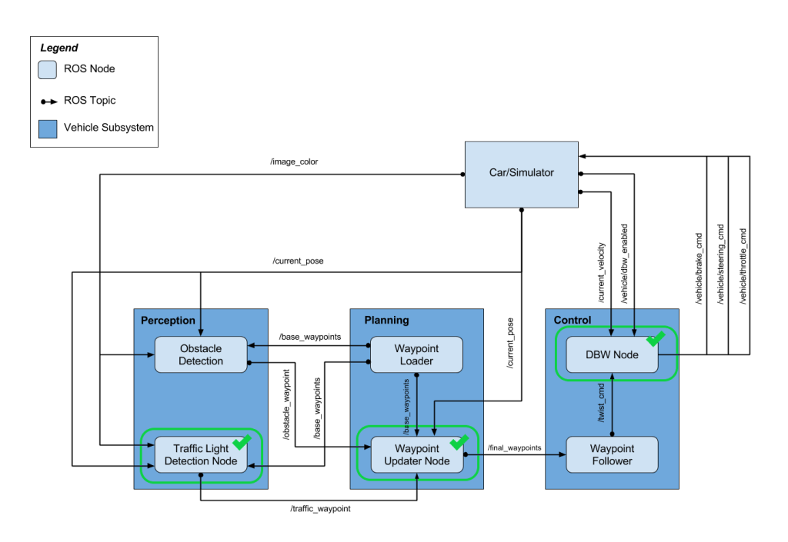

# Udacity Self-Driving Car Nanodegree: Capstone


This is the capstone project of Udacity's Self-driving Car Engineer nano degree. The goal is to write codes in ROS to drive a car in a simulation, as well as a real car Carla. The car is able to detect traffic light signal and be navigated by waypoints at planned veclocity by controlling the throttle, steer, and brake.

## Group Members
* [Kibaek Jeong](https://github.com/KibaekJeong) ([jgibak@gmail.com](jgibak@gmail.com))
* [Nuertey Duke Noi](https://github.com/dawn360) ([dukayslab@gmail.com](dukayslab@gmail.com))
* [Hong Cho](https://github.com/hong9life) ([hong9life@gmail.com](hong9life@gmail.com))
* [Shin-Ying Lu](https://github.com/shinyingl) ([shinyingl@gmail.com](shinyingl@gmail.com))

## Overview
Following repository is final code for the capstone project of [Udacity Self-Driving Car Nanodegree](https://www.udacity.com/course/self-driving-car-engineer-nanodegree--nd013).

Main objective of following project is to successfully drive an actual car (Carla) and car in simulator by detecting traffic light state, planning behavior and controlling the vehicle. In particular following project tackles three main subsystem of vehicle: Perception, Planning and Control:


Among all the components of the system, following three components were main focus of the team:
1. Traffic Light Detection: main component of perception system, which detects traffic light state.

2. Waypoint Updater:  main component of planning system, which is in charge of generating a trajectory of the vehicle.

3. Drive by Wire Controller: main component of control system, which translates twist messages generated by waypoint follower to control throttle, brake and steering.

## ROS Nodes

### Traffic Light Detection
The traffic light detection node is the main part of the perception sub system for following project. Traffic light detection node detects incoming traffic lights and its state. It detects state of the upcoming traffic light so that waypoint updater decides whether to stop at the traffic light or pass the traffic light.

For traffic light detector uses [Single Shot MultiBox Detector](https://arxiv.org/abs/1512.02325) with feature extractor of [MobileNetV2](https://arxiv.org/abs/1801.04381). Model pretraiined with [COCO Dataset](http://cocodataset.org/), which already includes traffic light category was used for following project. Tensorflow detection model is provided in following [link](https://github.com/tensorflow/models/blob/master/research/object_detection/g3doc/detection_model_zoo.md).

In order to maximize detection capability, transfer learning was done with two different dataset. First dataset was from Udacity. Photos of Udacity simulator and [Udacity Training Bag](https://s3-us-west-1.amazonaws.com/udacity-selfdrivingcar/traffic_light_bag_file.zip) provided by Udacity was used for first set. In addition, [Bosch Small Traffic Lights Dataset](https://hci.iwr.uni-heidelberg.de/node/6132) was used for training and evaluation.

As result, the model was able to detect all the traffic lights in Udacity simulator and Udacity on-site test images with no problem. Also, as detection timing is highly important as it is directly connected to passengers safety. Using MobileNetV2, we were able to achieve average detection time of 25ms.

Taffic light detector has successfully detected traffic light state in simulator ans we can see below.


### Waypoint updater
The Waypoint updater node is the main part of the planning tasks. The self driving car should follow the waypoints from the waypoint updater. The waypoint updater publishes waypoints ahead of the car by keeping track of the center of the lane lines, speed limit and the red traffic light and each waypoints are given with the target velocity. Hence, we have implemented the functions to generate final waypoints by using base waypoints from waypoint loader node, traffic lights status from the traffic light detection node and the car pose.


### Drive by  Wire (DBW)
The Drive By Wire (DBW) node is the main part of the control subsystem for throttle, brake and steering. We have implemented PID controllers for the throttle and brake.
Inputs for PID controller are error values between reference linear x velocity from waypoint follower and the measured current velocity. And output of PID controller is
the throttle and brake values which are determined by the target velocity.

With respect to steering values, we modified the yaw_controller for the stable lateral motion of the vehicle. We use the twist angular z from the waypint follower and steering value calculated by:
```python
steering angle = angle = atan(wheel_base * curvature)
```
To achieve smooth deccelartion at red light, we added a brake PID contorller in `twist_controller` and the below deccelrate velocity in waypoint updater. The velocity gets smaller as the car approaches to the stop line, the linear term is to ensure the velocity doesn't have a sudden drop as the distance to stop line get close to zero.
```python
math.sqrt(3 * MAX_DECEL * dist) + i
```
Below is a shows a summary how we use throttle and brake control to achieve the target speed:

|Condition			        |     throttle        				| brake|
|:---------------------:|:-------------------------------------:| :--:|
| curreent speed < target speed     	| PID control 			| 0|
| curreent speed > target speed     	| 0 | PID control 			|
| current speed <0.1 & target speed = 0      	|  0| brake = 700 (torque to hold the car) 			|


## Running Simulation
Please use **one** of the two installation options, either native **or** docker installation.
### Native Installation

* Be sure that your workstation is running Ubuntu 16.04 Xenial Xerus or Ubuntu 14.04 Trusty Tahir. [Ubuntu downloads can be found here](https://www.ubuntu.com/download/desktop).

* If using a Virtual Machine to install Ubuntu, use the following configuration as minimum:
  * 2 CPU
  * 2 GB system memory
  * 25 GB of free hard drive space

* Follow these instructions to install ROS
  * [ROS Kinetic](http://wiki.ros.org/kinetic/Installation/Ubuntu) if you have Ubuntu 16.04.
  * [ROS Indigo](http://wiki.ros.org/indigo/Installation/Ubuntu) if you have Ubuntu 14.04.
* [Dataspeed DBW](https://bitbucket.org/DataspeedInc/dbw_mkz_ros)
  * Use this option to install the SDK on a workstation that already has ROS installed: [One Line SDK Install (binary)](https://bitbucket.org/DataspeedInc/dbw_mkz_ros/src/81e63fcc335d7b64139d7482017d6a97b405e250/ROS_SETUP.md?fileviewer=file-view-default)
* Download the [Udacity Simulator](https://github.com/udacity/CarND-Capstone/releases).

### Docker Installation
[Install Docker](https://docs.docker.com/engine/installation/)

Build the docker container
```bash
docker build . -t capstone
```

Run the docker file
```bash
docker run -p 4567:4567 -v $PWD:/capstone -v /tmp/log:/root/.ros/ --rm -it capstone
```

### Port Forwarding
In order to run simulator, port 4567 has to be forwarded. For example, in Virtual box:
1. Open Oracle VM VirtualBox
2. Click on the default session and select settings.
3. Click on Network, Advanced, Port Forwarding.
4. Click on green plus sign, and add new port forwarding rule.
5. Add 4567 as both the host port and guest port.

### Running

1. Clone the project repository
```bash
git clone https://github.com/udacity/CarND-Capstone.git
```

2. Install python dependencies
```bash
cd CarND-Capstone
pip install -r requirements.txt
```
3. Make and run styx
```bash
cd ros
catkin_make
source devel/setup.sh
roslaunch launch/styx.launch
```
4. Run the simulator
